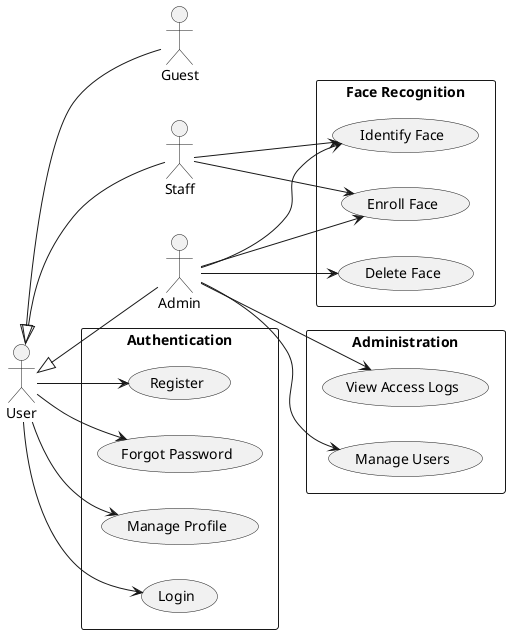
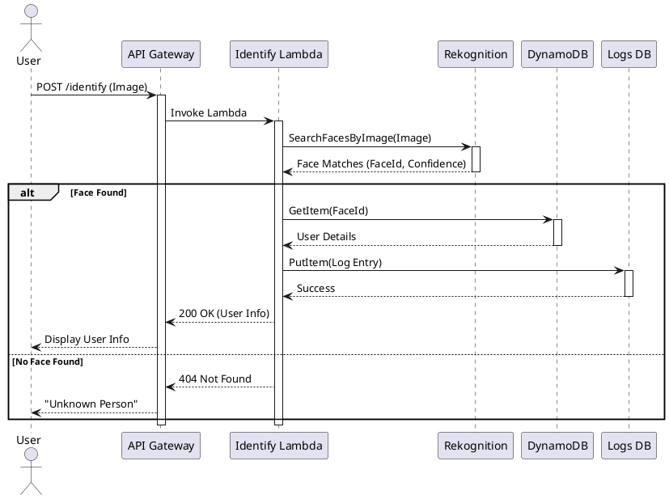
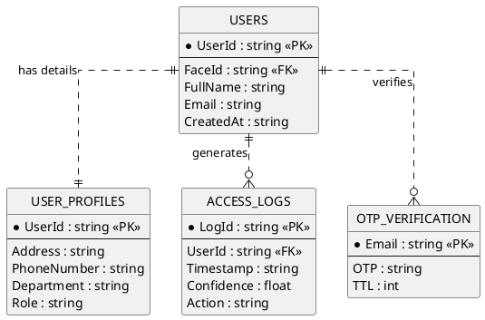

# UML Diagrams for Face Recognition System (All PlantUML)

This document contains **PlantUML** code for all diagrams. 

> [!IMPORTANT]
> **INSTRUCTIONS FOR DRAW.IO:**
> 1. Open [draw.io](https://app.diagrams.net/)
> 2. Go to **Arrange > Insert > Advanced > PlantUML**
> 3. Copy **ONLY** the code between the comments `' START COPYING HERE` and `' END COPYING HERE`.
> 4. **DO NOT** copy the ` ```plantuml ` or ` ``` ` lines.

## 1. Use Case Diagram



## 2. Architecture Diagram (AWS Style)

```plantuml
' START COPYING HERE
@startuml
!define AWSPuml https://raw.githubusercontent.com/awslabs/aws-icons-for-plantuml/v14.0/dist
!include AWSPuml/AWSCommon.puml
!include AWSPuml/General/User.puml
!include AWSPuml/Mobile/APIGateway.puml
!include AWSPuml/Compute/Lambda.puml
!include AWSPuml/Database/DynamoDB.puml
!include AWSPuml/Storage/SimpleStorageService.puml
!include AWSPuml/MachineLearning/Rekognition.puml
!include AWSPuml/SecurityIdentityCompliance/Cognito.puml
!include AWSPuml/SecurityIdentityCompliance/KeyManagementService.puml

title Face Recognition System Architecture

left to right direction

actor "User" as user
actor "Admin" as admin

package "AWS Cloud" {
    package "Public Zone" {
        APIGateway(api, "API Gateway", "REST API")
        Cognito(cognito, "Cognito User Pool", "Auth & Users")
    }

    package "Compute Layer (Serverless)" {
        Lambda(authFn, "Auth Handler", "User Mgmt")
        Lambda(enrollFn, "Enroll Handler", "Face Indexing")
        Lambda(identifyFn, "Identify Handler", "Face Search")
        Lambda(peopleFn, "People Handler", "Profile Mgmt")
        Lambda(loggingFn, "Logging Handler", "Access Logs")
    }

    package "Storage & Data Layer" {
        SimpleStorageService(rawBucket, "Raw Bucket", "Images")
        SimpleStorageService(processedBucket, "Processed Bucket", "Thumbnails")
        
        DynamoDB(usersTable, "Users Table", "Metadata")
        DynamoDB(logsTable, "Access Logs", "History")
        DynamoDB(profilesTable, "User Profiles", "Details")
        
        Rekognition(rekognition, "Rekognition", "Face Collection")
    }
    
    package "Security" {
        KeyManagementService(kms, "KMS", "Encryption Keys")
    }
}

user --> api : HTTPS
admin --> api : HTTPS

api --> authFn : /auth
api --> enrollFn : /enroll
api --> identifyFn : /identify
api --> peopleFn : /people
api --> loggingFn : /logs

authFn --> cognito : Auth/User Mgmt
authFn --> profilesTable : Read/Write

enrollFn --> rawBucket : Upload Image
enrollFn --> rekognition : IndexFaces
enrollFn --> usersTable : Save Metadata
enrollFn --> kms : Decrypt

identifyFn --> rekognition : SearchFacesByImage
identifyFn --> usersTable : Lookup User
identifyFn --> logsTable : Record Log

peopleFn --> usersTable : Update/Delete
peopleFn --> rekognition : DeleteFaces

loggingFn --> logsTable : Read Logs

@enduml
' END COPYING HERE
```

## 3. Sequence Diagram (Identify Face)



## 4. Deployment Diagram

```plantuml
' START COPYING HERE
@startuml
!define AWSPuml https://raw.githubusercontent.com/awslabs/aws-icons-for-plantuml/v14.0/dist
!include AWSPuml/AWSCommon.puml
!include AWSPuml/General/Client.puml
!include AWSPuml/NetworkingAndContentDelivery/CloudFront.puml
!include AWSPuml/Storage/SimpleStorageService.puml
!include AWSPuml/Mobile/APIGateway.puml
!include AWSPuml/Compute/Lambda.puml
!include AWSPuml/Database/DynamoDB.puml

title Deployment Diagram

node "Client Device" {
    Client(browser, "Web/Desktop App", "React/Electron")
}

package "AWS Cloud" {
    package "Frontend Hosting" {
        CloudFront(cf, "CloudFront", "CDN")
        SimpleStorageService(webBucket, "Web Bucket", "Static Assets")
    }

    package "Backend API" {
        APIGateway(api, "API Gateway", "Regional Endpoint")
        
        node "Lambda Functions" {
            Lambda(fn1, "Auth Function", "Python 3.11")
            Lambda(fn2, "Enroll Function", "Python 3.11")
            Lambda(fn3, "Identify Function", "Python 3.11")
        }
    }

    package "Data Persistence" {
        DynamoDB(db, "DynamoDB Tables", "On-Demand")
    }
}

browser --> cf : HTTPS (Frontend)
cf --> webBucket : Origin
browser --> api : HTTPS (API Calls)
api --> fn1
api --> fn2
api --> fn3
fn1 --> db
fn2 --> db
fn3 --> db

@enduml
' END COPYING HERE
```

## 5. Data Diagram (ERD)


