# Face Recognition AWS Architecture

## 🏗️ System Architecture Diagram

```mermaid
%%{init: {'theme':'base', 'themeVariables': { 'primaryColor':'#FF6C37','primaryTextColor':'#fff','primaryBorderColor':'#FF6C37','lineColor':'#F8B229','secondaryColor':'#2ECC71','tertiaryColor':'#3498DB'}}}%%

graph TB
    subgraph Internet["☁️ Internet"]
        Users["👥 Users<br/>(Web/Mobile/Desktop)"]
    end
    
    subgraph AWS["🔶 AWS Cloud - ap-southeast-1"]
        subgraph VPC["🔐 VPC"]
            subgraph APILayer["API Layer"]
                APIG["🌐 API Gateway<br/>r7hwlthie5<br/>📍 /health /people /stats<br/>📍 /thresholds /enroll /identify"]
            end
            
            subgraph ComputeExtended["💻 Lambda - Extended Stack"]
                L1["⚡ HealthFunction"]
                L2["⚡ ListPeopleFunction"]
                L3["⚡ DbStatsFunction"]
                L4["⚡ GetThresholdsFunction"]
            end
            
            subgraph ComputeBusiness["🔴 Lambda - Business Stack"]
                L5["🔴 EnrollFunction<br/>(Face Registration)"]
                L6["🔴 IdentifyFunction<br/>(Face Recognition)"]
            end
            
            subgraph Storage["💾 Storage Layer"]
                DB1["🗄️ DynamoDB: Users<br/>face-recognition-users-prod-773600<br/>PK: person_id"]
                DB2["🗄️ DynamoDB: Embeddings<br/>face-recognition-embeddings-prod-773600<br/>PK: person_id | SK: face_id"]
                DB3["🗄️ DynamoDB: Access Logs<br/>face-recognition-access-logs-prod-773600<br/>PK: log_id"]
            end
            
            subgraph AIServices["🤖 AI/ML Services"]
                REK["🔍 Amazon Rekognition<br/>face-recognition-collection<br/>Face Detection & Search"]
            end
            
            subgraph ObjectStorage["📦 Object Storage"]
                S3["🪣 Amazon S3<br/>face-recognition-images-829717935400<br/>📁 /enrollments | /identifications"]
            end
            
            subgraph Config["⚙️ Configuration"]
                SSM["📋 Systems Manager<br/>Parameter Store<br/>• attendance: 90%<br/>• access_control: 95%<br/>• financial: 98%"]
            end
            
            subgraph Auth["🔐 Authentication (Future)"]
                COG["👤 Amazon Cognito<br/>User Pool<br/>ap-southeast-1_qQKOiB3OZ"]
            end
            
            subgraph Monitoring["📊 Monitoring"]
                CW["📈 CloudWatch<br/>Logs + Dashboard<br/>6 Log Groups | 7 days"]
            end
        end
        
        subgraph IaC["🏗️ Infrastructure as Code"]
            CF1["☁️ CloudFormation<br/>FaceRecognitionMinimal<br/>11 resources | 53s"]
            CF2["☁️ CloudFormation<br/>FaceRecognitionExtended<br/>41 resources | 72s"]
            CF3["☁️ CloudFormation<br/>FaceRecognitionBusiness<br/>23 resources | 71s"]
            CF4["☁️ CloudFormation<br/>CDKToolkit<br/>Bootstrap Stack"]
        end
    end
    
    %% Connections
    Users -->|"🔒 HTTPS"| APIG
    
    APIG -->|"📞 Invoke"| L1
    APIG -->|"📞 Invoke"| L2
    APIG -->|"📞 Invoke"| L3
    APIG -->|"📞 Invoke"| L4
    APIG -->|"🔴 POST /enroll"| L5
    APIG -->|"🔴 POST /identify"| L6
    
    L1 -.->|"✅ Health Check"| DB1
    L2 -.->|"📖 Query"| DB1
    L3 -.->|"📊 Stats"| DB1
    L3 -.->|"📊 Stats"| DB2
    L3 -.->|"📊 Stats"| DB3
    L4 -.->|"🔍 Read"| SSM
    
    L5 -->|"📸 Index Face"| REK
    L5 -->|"💾 Upload Image"| S3
    L5 -->|"💿 Save Data"| DB1
    L5 -->|"💿 Save Embedding"| DB2
    L5 -.->|"⚙️ Get Threshold"| SSM
    
    L6 -->|"🔍 Search Face"| REK
    L6 -->|"📖 Query User"| DB1
    L6 -->|"📖 Query Embedding"| DB2
    L6 -->|"📝 Log Access"| DB3
    L6 -.->|"⚙️ Get Threshold"| SSM
    
    REK -.->|"🔗 Face Data"| S3
    
    L1 -.->|"📝 Logs"| CW
    L2 -.->|"📝 Logs"| CW
    L3 -.->|"📝 Logs"| CW
    L4 -.->|"📝 Logs"| CW
    L5 -.->|"📝 Logs"| CW
    L6 -.->|"📝 Logs"| CW
    
    COG -.->|"🔐 Auth (Future)"| APIG
    
    CF1 -.->|"🏗️ Manages"| DB1
    CF1 -.->|"🏗️ Manages"| DB2
    CF1 -.->|"🏗️ Manages"| DB3
    CF1 -.->|"🏗️ Manages"| COG
    CF1 -.->|"🏗️ Manages"| SSM
    
    CF2 -.->|"🏗️ Manages"| APIG
    CF2 -.->|"🏗️ Manages"| L1
    CF2 -.->|"🏗️ Manages"| L2
    CF2 -.->|"🏗️ Manages"| L3
    CF2 -.->|"🏗️ Manages"| L4
    
    CF3 -.->|"🏗️ Manages"| L5
    CF3 -.->|"🏗️ Manages"| L6
    
    classDef apiGateway fill:#FF9900,stroke:#FF6C37,stroke-width:3px,color:#fff
    classDef lambdaExtended fill:#FF9900,stroke:#FF6C37,stroke-width:2px,color:#fff
    classDef lambdaBusiness fill:#FF4D4D,stroke:#CC0000,stroke-width:3px,color:#fff
    classDef dynamodb fill:#3B48CC,stroke:#2E3A8C,stroke-width:2px,color:#fff
    classDef rekognition fill:#8B5CF6,stroke:#6D28D9,stroke-width:2px,color:#fff
    classDef s3 fill:#569A31,stroke:#3D7021,stroke-width:2px,color:#fff
    classDef ssm fill:#FFA500,stroke:#FF8C00,stroke-width:2px,color:#fff
    classDef cognito fill:#3B82F6,stroke:#1D4ED8,stroke-width:2px,color:#fff
    classDef cloudwatch fill:#6B7280,stroke:#4B5563,stroke-width:2px,color:#fff
    classDef cloudformation fill:#22C55E,stroke:#16A34A,stroke-width:2px,color:#fff
    classDef users fill:#A855F7,stroke:#7C3AED,stroke-width:2px,color:#fff
    
    class APIG apiGateway
    class L1,L2,L3,L4 lambdaExtended
    class L5,L6 lambdaBusiness
    class DB1,DB2,DB3 dynamodb
    class REK rekognition
    class S3 s3
    class SSM ssm
    class COG cognito
    class CW cloudwatch
    class CF1,CF2,CF3,CF4 cloudformation
    class Users users
```



## 📊 System Statistics

| Metric | Value |
|--------|-------|
| **Total AWS Resources** | 75 |
| **Deployment Time** | 3m 16s |
| **Lambda Functions** | 6 |
| **DynamoDB Tables** | 3 |
| **API Endpoints** | 6 |
| **AWS Region** | ap-southeast-1 (Singapore) |
| **Account ID** | 758934444761 |
| **Lambda Runtime** | Python 3.11 |

## 🔗 API Base URL

```
https://r7hwlthie5.execute-api.ap-southeast-1.amazonaws.com/prod/
```

## 📍 Available Endpoints

| Method | Endpoint | Lambda Function | Status |
|--------|----------|-----------------|--------|
| GET | `/health` | HealthFunction | ✅ Active |
| GET | `/people` | ListPeopleFunction | ✅ Active |
| GET | `/stats` | DbStatsFunction | ✅ Active |
| GET | `/thresholds` | GetThresholdsFunction | ✅ Active |
| POST | `/enroll` | EnrollFunction | 🔴 Ready to Test |
| POST | `/identify` | IdentifyFunction | 🔴 Ready to Test |

## 🔄 Data Flow

### Enrollment Flow (POST /enroll)
```
Client → API Gateway → EnrollFunction
           ↓
EnrollFunction → S3 (Upload Image)
           ↓
EnrollFunction → Rekognition (Index Face)
           ↓
EnrollFunction → DynamoDB (Save User + Embedding)
           ↓
EnrollFunction → CloudWatch (Log)
           ↓
Return: { person_id, face_id, status: "enrolled" }
```

### Identification Flow (POST /identify)
```
Client → API Gateway → IdentifyFunction
           ↓
IdentifyFunction → Rekognition (Search Face)
           ↓
IdentifyFunction → SSM (Get Threshold)
           ↓
IdentifyFunction → DynamoDB (Query User + Log Access)
           ↓
IdentifyFunction → CloudWatch (Log)
           ↓
Return: { person_id, name, confidence, match: true/false }
```

## 🏗️ CloudFormation Stacks

### 1. FaceRecognitionMinimal (11 resources - 53s)
- 3× DynamoDB Tables (Users, Embeddings, Access Logs)
- 1× Cognito User Pool
- 3× SSM Parameters (Thresholds)
- 1× CloudWatch Dashboard
- IAM Roles & Policies

### 2. FaceRecognitionExtended (41 resources - 72s)
- 1× API Gateway REST API
- 4× Lambda Functions (Health, People, Stats, Thresholds)
- API Integrations & Methods
- CORS Configuration
- Lambda Permissions
- CloudWatch Log Groups

### 3. FaceRecognitionBusiness (23 resources - 71s)
- 2× Lambda Functions (Enroll, Identify)
- API Gateway Integrations
- Lambda Permissions
- CloudWatch Log Groups
- IAM Roles

### 4. CDKToolkit (Bootstrap)
- S3 Bucket for CDK assets
- IAM Roles for deployment
- CloudFormation execution role

## 🎨 Architecture Highlights

- **🔒 Security**: VPC isolation, IAM roles, future Cognito integration
- **⚡ Serverless**: 100% serverless with Lambda + API Gateway
- **💾 Storage**: DynamoDB On-Demand for flexible scaling
- **🤖 AI/ML**: Amazon Rekognition for face detection/recognition
- **📊 Monitoring**: CloudWatch Logs with 7-day retention
- **🏗️ IaC**: AWS CDK for infrastructure management
- **📦 Object Storage**: S3 for image persistence
- **⚙️ Configuration**: SSM Parameter Store for dynamic thresholds

---

**Note**: This diagram can be viewed directly in GitHub, VS Code (with Mermaid preview), or exported to PNG/SVG.
