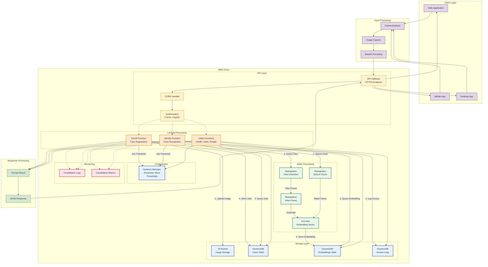
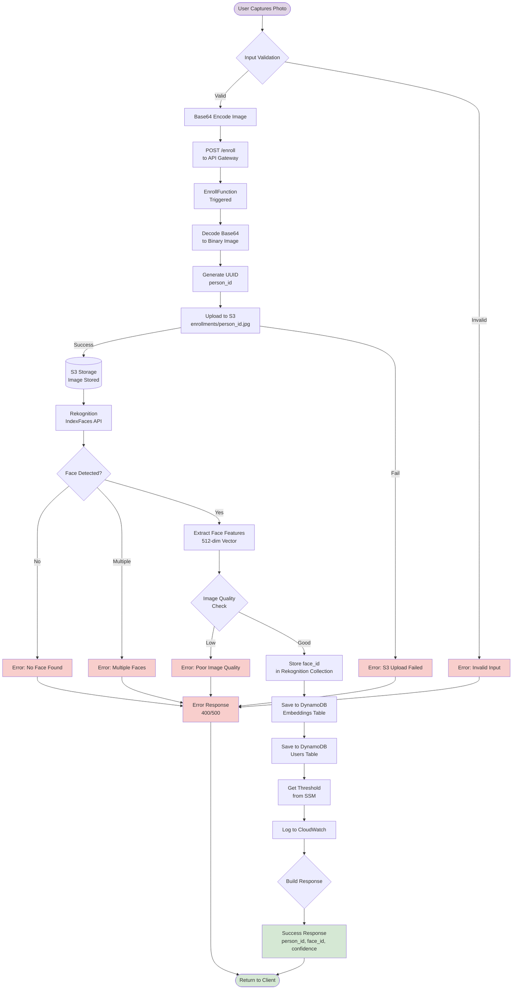
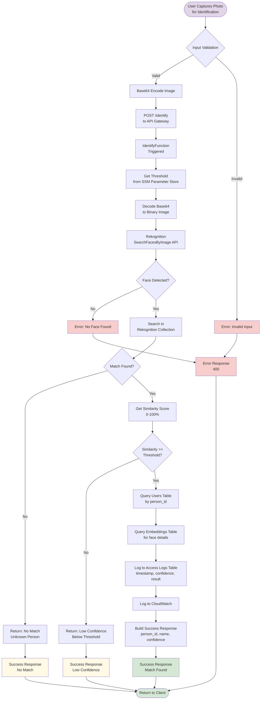
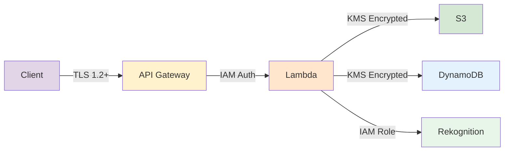

# Face Recognition System - Data Flow Diagram

## 🔄 Overall System Data Flow



---

## 📊 Enrollment Data Flow (Detailed)



---

## 🔍 Identification Data Flow (Detailed)



---

## 📦 Data Types & Transformations

### Input Data Format

```json
// Enrollment Request
{
  "image": "data:image/jpeg;base64,/9j/4AAQSkZJRg...",
  "name": "John Doe",
  "user_name": "john.doe",
  "metadata": {
    "department": "IT",
    "employee_id": "E001",
    "role": "Developer"
  }
}

// Identification Request
{
  "image": "data:image/jpeg;base64,/9j/4AAQSkZJRg...",
  "use_case": "attendance"
}
```

### Processing Transformations

```
1. Base64 String (from client)
   ↓
2. Binary Image Data (Lambda decode)
   ↓
3. Image Validation (size, format, dimensions)
   ↓
4. Face Detection (Rekognition)
   ↓
5. 512-Dimensional Vector (embedding)
   ↓
6. Normalized Vector (0-1 range)
   ↓
7. Storage in DynamoDB (JSON format)
```

### Output Data Format

```json
// Enrollment Response
{
  "success": true,
  "person_id": "550e8400-e29b-41d4-a716-446655440000",
  "face_id": "face_20251120_103000",
  "rekognition_face_id": "2a2b3c4d-5e6f-7g8h-9i0j-1k2l3m4n5o6p",
  "confidence": 99.87,
  "s3_url": "s3://bucket/enrollments/550e8400.jpg",
  "bounding_box": {
    "Width": 0.5,
    "Height": 0.6,
    "Left": 0.2,
    "Top": 0.1
  },
  "timestamp": "2025-11-20T10:30:00Z"
}

// Identification Response (Match Found)
{
  "success": true,
  "match": true,
  "person_id": "550e8400-e29b-41d4-a716-446655440000",
  "name": "John Doe",
  "user_name": "john.doe",
  "confidence": 98.5,
  "threshold": 90.0,
  "metadata": {
    "department": "IT",
    "employee_id": "E001"
  },
  "timestamp": "2025-11-20T10:35:00Z"
}

// Identification Response (No Match)
{
  "success": true,
  "match": false,
  "reason": "No matching face found",
  "timestamp": "2025-11-20T10:35:00Z"
}
```

---

## 📊 Data Size Estimates

### Image Data
- **Input**: 1-5 MB (JPEG/PNG from client)
- **Base64 Encoded**: +33% size increase (1.3-6.5 MB)
- **S3 Storage**: Original size (1-5 MB per image)
- **Lambda Memory**: 10 MB buffer for processing

### Embedding Vector
- **Dimensions**: 512 floats
- **Size**: 512 × 4 bytes = 2,048 bytes (2 KB)
- **DynamoDB Storage**: ~8 KB (with metadata)

### Response Payload
- **Enrollment**: ~500 bytes (JSON)
- **Identification**: ~800 bytes (JSON)
- **List People**: ~5-50 KB (depending on page size)

---

## 🔄 Data Flow States

### Enrollment States
```
IDLE → CAPTURING → ENCODING → UPLOADING → DETECTING → 
INDEXING → STORING → LOGGING → SUCCESS
                ↓ (at any point)
              ERROR
```

### Identification States
```
IDLE → CAPTURING → ENCODING → SEARCHING → MATCHING → 
QUERYING → LOGGING → SUCCESS
                ↓ (at any point)
              NO_MATCH / LOW_CONFIDENCE / ERROR
```

---

## ⚡ Performance Metrics

| Stage | Average Time | Max Time | Data Transfer |
|-------|--------------|----------|---------------|
| Image Capture | 100-500ms | 2s | Client-side |
| Base64 Encode | 50-200ms | 500ms | Client-side |
| API Gateway | 10-50ms | 200ms | HTTP headers |
| Lambda Cold Start | 1-3s | 5s | N/A |
| Lambda Warm | 100-500ms | 1s | N/A |
| S3 Upload | 200-800ms | 2s | 1-5 MB |
| Rekognition Index | 500-1500ms | 3s | 1-5 MB |
| Rekognition Search | 300-1000ms | 2s | 1-5 MB |
| DynamoDB Write | 10-50ms | 200ms | <1 KB |
| DynamoDB Query | 10-30ms | 100ms | <10 KB |
| **Total Enrollment** | **2-3s** | **8s** | 1-5 MB |
| **Total Identification** | **1-2s** | **5s** | 1-5 MB |

---

## 🔐 Data Security Flow



**Security Measures:**
- ✅ TLS 1.2+ for all client connections
- ✅ IAM roles for Lambda execution
- ✅ KMS encryption at rest (S3, DynamoDB)
- ✅ VPC endpoints for private connectivity
- ✅ CloudWatch audit logs
- ✅ Parameter Store for sensitive configs
