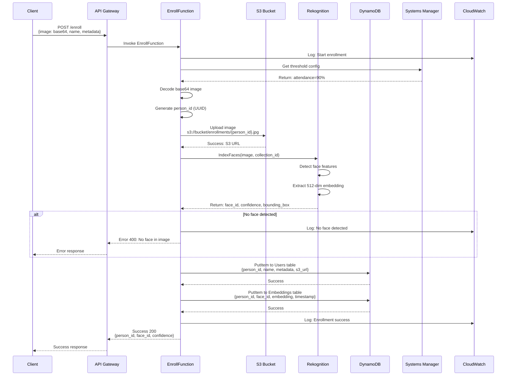
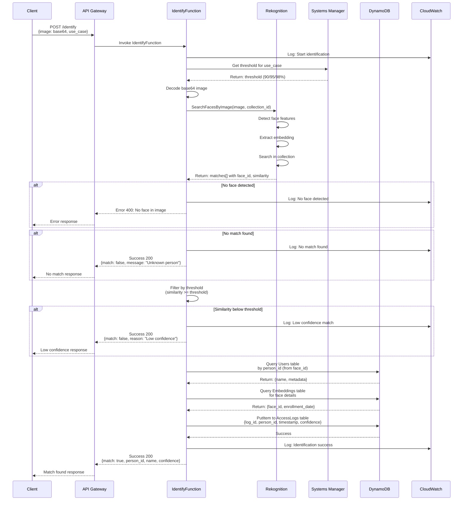
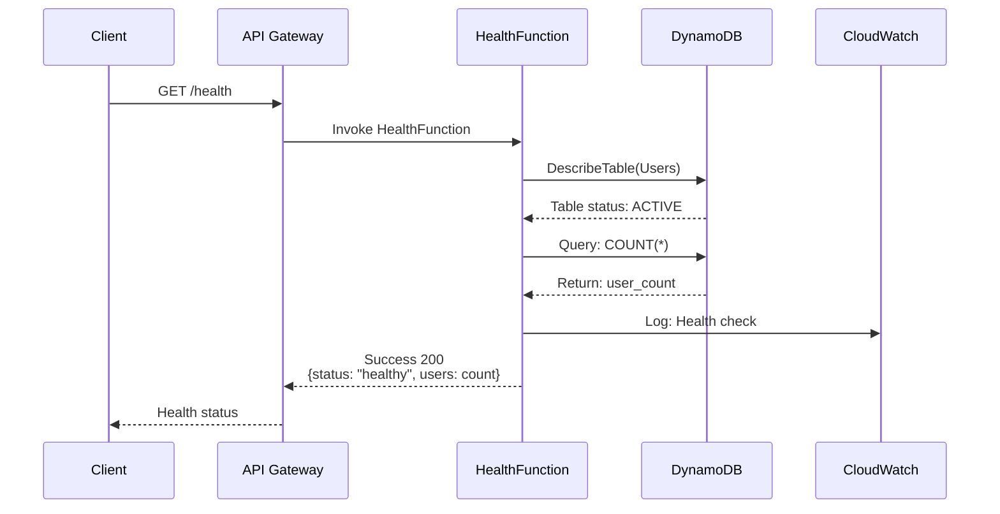
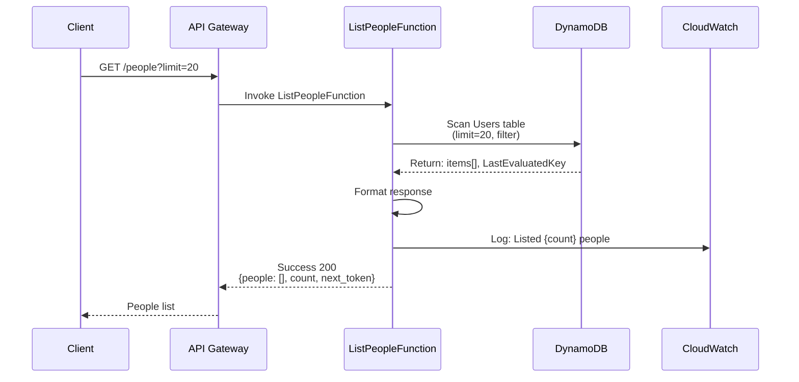
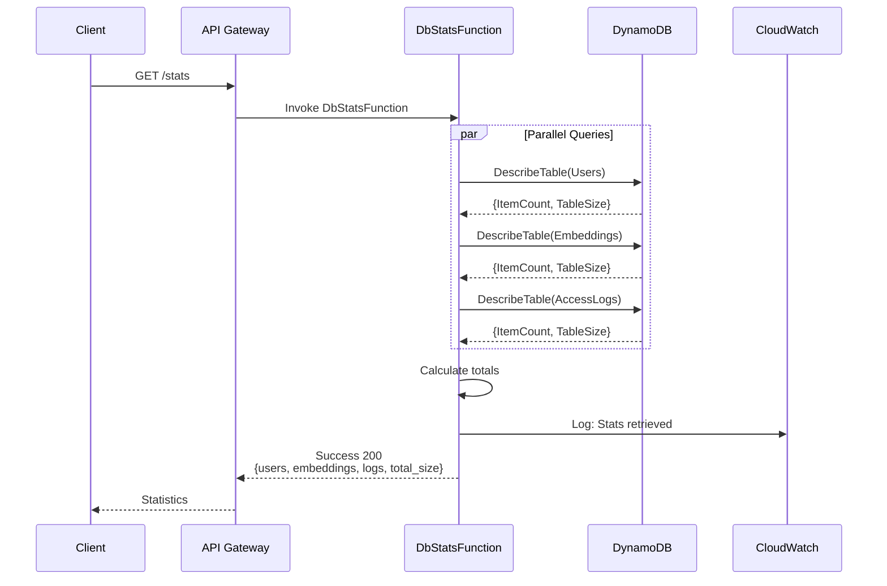
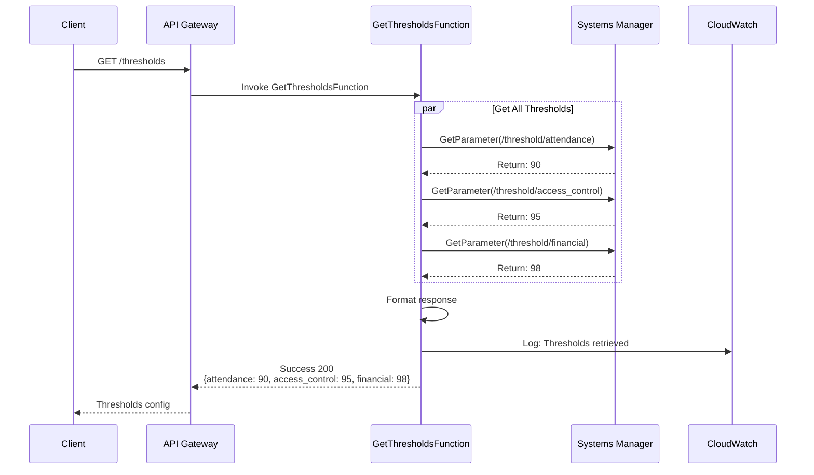
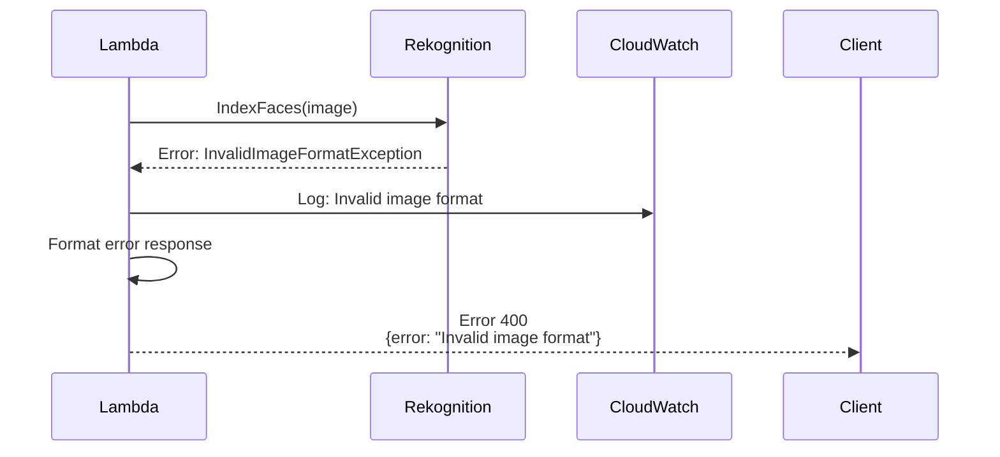
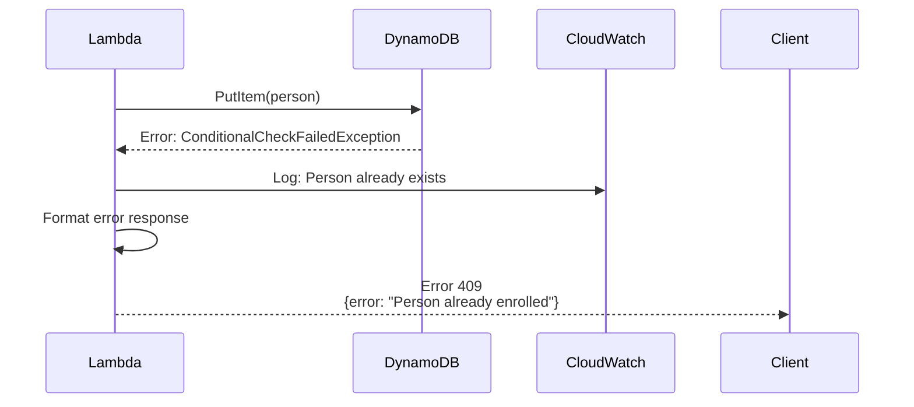

# Face Recognition System - Sequence Diagrams

## 🔄 Enrollment Flow (POST /enroll)

---

## 🔍 Identification Flow (POST /identify)

---

## 📊 Health Check Flow (GET /health)

---

## 👥 List People Flow (GET /people)

---

## 📈 Stats Flow (GET /stats)

---

## ⚙️ Get Thresholds Flow (GET /thresholds)

---

## 🔴 Error Handling Flows

### Rekognition Error

### DynamoDB Error

---

## 📊 Flow Summary

| Flow | Method | Lambda | Services Used | Response Time |
|------|--------|--------|---------------|---------------|
| Enrollment | POST /enroll | EnrollFunction | S3, Rekognition, DynamoDB, SSM | ~2-3s |
| Identification | POST /identify | IdentifyFunction | Rekognition, DynamoDB, SSM | ~1-2s |
| Health Check | GET /health | HealthFunction | DynamoDB | ~100-200ms |
| List People | GET /people | ListPeopleFunction | DynamoDB | ~200-500ms |
| Stats | GET /stats | DbStatsFunction | DynamoDB | ~300-600ms |
| Thresholds | GET /thresholds | GetThresholdsFunction | SSM | ~100-200ms |

---

## 🔑 Key Points

### Enrollment Process:
1. Validate & decode image
2. Upload to S3
3. Index face with Rekognition
4. Store user + embedding in DynamoDB
5. Return person_id

### Identification Process:
1. Validate & decode image
2. Search face in Rekognition collection
3. Check confidence threshold
4. Query user details from DynamoDB
5. Log access
6. Return match result

### Error Scenarios:
- **No face detected**: 400 Bad Request
- **Multiple faces**: 400 Bad Request (current implementation)
- **Low confidence**: 200 OK with match=false
- **No match**: 200 OK with match=false
- **Service errors**: 500 Internal Server Error
