# Face Recognition System - Use Case Diagram

## 🎭 Use Case Diagram

```mermaid
graph TB
    subgraph "Face Recognition System"
        subgraph "Enrollment Use Cases"
            UC1[Register New Person]
            UC2[Upload Face Image]
            UC3[Validate Image Quality]
            UC4[Store Face Embedding]
        end
        
        subgraph "Identification Use Cases"
            UC5[Identify Person]
            UC6[Verify Identity]
            UC7[Check Attendance]
            UC8[Access Control]
            UC9[Financial Verification]
        end
        
        subgraph "Management Use Cases"
            UC10[List All People]
            UC11[View Person Details]
            UC12[Get System Statistics]
            UC13[View Access Logs]
            UC14[Delete Person]
        end
        
        subgraph "Configuration Use Cases"
            UC15[Get Threshold Settings]
            UC16[Update Thresholds]
            UC17[Health Check]
        end
    end
    
    subgraph "Actors"
        EndUser[👤 End User]
        Admin[👨‍💼 Administrator]
        System[🖥️ System Admin]
        HR[👥 HR Manager]
        Security[🔐 Security Officer]
        Finance[💰 Finance Officer]
    end
    
    %% End User connections
    EndUser --> UC1
    EndUser --> UC2
    EndUser --> UC5
    
    %% HR Manager connections
    HR --> UC1
    HR --> UC10
    HR --> UC11
    HR --> UC7
    HR --> UC13
    
    %% Security Officer connections
    Security --> UC5
    Security --> UC8
    Security --> UC13
    Security --> UC14
    
    %% Finance Officer connections
    Finance --> UC9
    Finance --> UC13
    
    %% Administrator connections
    Admin --> UC10
    Admin --> UC11
    Admin --> UC12
    Admin --> UC13
    Admin --> UC14
    Admin --> UC15
    Admin --> UC16
    
    %% System Admin connections
    System --> UC17
    System --> UC12
    System --> UC15
    System --> UC16
    
    %% Include relationships
    UC1 -.->|includes| UC2
    UC2 -.->|includes| UC3
    UC1 -.->|includes| UC4
    UC5 -.->|includes| UC6
    UC7 -.->|extends| UC5
    UC8 -.->|extends| UC5
    UC9 -.->|extends| UC5
    UC13 -.->|includes| UC11
    
    %% Styling
    classDef actorClass fill:#E1D5E7,stroke:#9673A6,stroke-width:3px
    classDef enrollClass fill:#E8F5E9,stroke:#277116,stroke-width:2px
    classDef identifyClass fill:#E3F2FD,stroke:#3334B9,stroke-width:2px
    classDef manageClass fill:#FFF9E6,stroke:#F9A825,stroke-width:2px
    classDef configClass fill:#FCE4EC,stroke:#C7131F,stroke-width:2px
    
    class EndUser,Admin,System,HR,Security,Finance actorClass
    class UC1,UC2,UC3,UC4 enrollClass
    class UC5,UC6,UC7,UC8,UC9 identifyClass
    class UC10,UC11,UC12,UC13,UC14 manageClass
    class UC15,UC16,UC17 configClass
```

---

## 📋 Use Case Descriptions

### 🟢 Enrollment Use Cases

#### UC1: Register New Person
**Actor**: End User, HR Manager  
**Description**: Register a new person in the face recognition system  
**Preconditions**: User has access to the system  
**Postconditions**: Person is enrolled with face data stored  
**Main Flow**:
1. User provides name and metadata
2. System validates input
3. User uploads face image (UC2)
4. System validates image quality (UC3)
5. System extracts and stores face embedding (UC4)
6. System returns success with person_id

**Alternative Flows**:
- 3a. No face detected → Return error
- 3b. Multiple faces detected → Return error
- 4a. Poor image quality → Request better image

**API Endpoint**: `POST /enroll`

---

#### UC2: Upload Face Image
**Actor**: End User, HR Manager  
**Description**: Upload or capture face image for enrollment  
**Preconditions**: Image is in JPEG/PNG format  
**Postconditions**: Image is uploaded to S3  
**Main Flow**:
1. User captures or selects image
2. System encodes image to Base64
3. System uploads to S3 bucket
4. System returns S3 URL

**API Endpoint**: Part of `POST /enroll`

---

#### UC3: Validate Image Quality
**Actor**: System (automatic)  
**Description**: Validate uploaded image meets quality standards  
**Preconditions**: Image has been uploaded  
**Postconditions**: Image quality is assessed  
**Main Flow**:
1. System checks image dimensions
2. System checks file size (max 5MB)
3. System checks face detectability
4. System assesses image clarity
5. System returns quality score

**Quality Criteria**:
- Minimum resolution: 640x480
- Face size: At least 200x200 pixels
- Brightness: Adequate lighting
- Blur: Sharp image required

---

#### UC4: Store Face Embedding
**Actor**: System (automatic)  
**Description**: Extract and store 512-dimensional face embedding  
**Preconditions**: Face has been detected and validated  
**Postconditions**: Embedding stored in DynamoDB and Rekognition  
**Main Flow**:
1. System calls Rekognition IndexFaces
2. Rekognition extracts 512-dim vector
3. System stores in Embeddings table
4. System stores in Users table
5. System returns face_id

---

### 🔵 Identification Use Cases

#### UC5: Identify Person
**Actor**: End User, HR Manager, Security Officer  
**Description**: Identify a person from their face image  
**Preconditions**: System has enrolled faces  
**Postconditions**: Person is identified or marked as unknown  
**Main Flow**:
1. User captures face image
2. System searches in Rekognition collection
3. System retrieves matching person details
4. System logs access attempt
5. System returns identification result

**Alternative Flows**:
- 2a. No face detected → Return error
- 3a. No match found → Return "Unknown person"
- 3b. Confidence below threshold → Return "Low confidence"

**API Endpoint**: `POST /identify`

---

#### UC6: Verify Identity
**Actor**: System (automatic)  
**Description**: Verify if captured face matches claimed identity  
**Preconditions**: Person claims specific identity  
**Postconditions**: Identity verified or rejected  
**Main Flow**:
1. User provides person_id and face image
2. System searches for specific person
3. System compares confidence score
4. System returns verification result (true/false)

**API Endpoint**: `POST /identify` with person_id filter

---

#### UC7: Check Attendance
**Actor**: HR Manager, End User  
**Description**: Record attendance using face recognition (90% threshold)  
**Preconditions**: Employee is enrolled in system  
**Postconditions**: Attendance is recorded  
**Main Flow**:
1. Employee captures face at entrance
2. System identifies with 90% threshold
3. System logs attendance with timestamp
4. System returns success message

**Business Rules**:
- Threshold: 90%
- Use case: "attendance"
- Duplicate check: Same person within 5 minutes

**API Endpoint**: `POST /identify?use_case=attendance`

---

#### UC8: Access Control
**Actor**: Security Officer, End User  
**Description**: Grant/deny access to secure areas (95% threshold)  
**Preconditions**: Person is enrolled with access permissions  
**Postconditions**: Access granted or denied  
**Main Flow**:
1. Person approaches secure door
2. Camera captures face
3. System identifies with 95% threshold
4. System checks access permissions
5. System opens door or denies access
6. System logs access attempt

**Business Rules**:
- Threshold: 95%
- Use case: "access_control"
- Log all attempts (success and failure)

**API Endpoint**: `POST /identify?use_case=access_control`

---

#### UC9: Financial Verification
**Actor**: Finance Officer, End User  
**Description**: Verify identity for financial transactions (98% threshold)  
**Preconditions**: Person is enrolled and authorized for transactions  
**Postconditions**: Transaction approved or rejected  
**Main Flow**:
1. User initiates financial transaction
2. System requests face verification
3. User captures face
4. System identifies with 98% threshold
5. System approves/rejects transaction
6. System logs financial verification

**Business Rules**:
- Threshold: 98% (highest security)
- Use case: "financial"
- Two-factor: Face + PIN/password
- Log retention: 7 years (compliance)

**API Endpoint**: `POST /identify?use_case=financial`

---

### 🟡 Management Use Cases

#### UC10: List All People
**Actor**: HR Manager, Administrator  
**Description**: View list of all enrolled people  
**Preconditions**: User has admin access  
**Postconditions**: List of people is displayed  
**Main Flow**:
1. Admin requests people list
2. System queries Users table
3. System returns paginated results
4. Admin views list with pagination

**API Endpoint**: `GET /people?limit=20&next_token=...`

---

#### UC11: View Person Details
**Actor**: HR Manager, Administrator, Security Officer  
**Description**: View detailed information about specific person  
**Preconditions**: Person exists in system  
**Postconditions**: Details are displayed  
**Main Flow**:
1. Admin selects person from list
2. System retrieves user details
3. System retrieves face embeddings
4. System retrieves recent access logs
5. Admin views complete profile

**API Endpoint**: `GET /people/{person_id}`

---

#### UC12: Get System Statistics
**Actor**: Administrator, System Admin  
**Description**: View system statistics and metrics  
**Preconditions**: User has admin access  
**Postconditions**: Statistics are displayed  
**Main Flow**:
1. Admin requests system stats
2. System queries all DynamoDB tables
3. System calculates totals
4. System returns statistics

**Statistics Include**:
- Total enrolled users
- Total face embeddings
- Total access logs
- Storage usage
- API call counts

**API Endpoint**: `GET /stats`

---

#### UC13: View Access Logs
**Actor**: HR Manager, Administrator, Security Officer, Finance Officer  
**Description**: View access/identification logs  
**Preconditions**: User has appropriate permissions  
**Postconditions**: Logs are displayed  
**Main Flow**:
1. User requests logs (optional: filtered by person/date)
2. System queries AccessLogs table
3. System returns paginated results
4. User views logs with details

**Filter Options**:
- By person_id
- By date range
- By use_case (attendance/access/financial)
- By result (success/failure)

**API Endpoint**: `GET /logs?person_id=...&start_date=...&end_date=...`

---

#### UC14: Delete Person
**Actor**: Administrator, Security Officer  
**Description**: Remove person from system (soft delete)  
**Preconditions**: User has delete permissions  
**Postconditions**: Person is marked as inactive  
**Main Flow**:
1. Admin selects person to delete
2. System confirms deletion
3. System marks user as "inactive" in Users table
4. System removes face from Rekognition collection
5. System marks embeddings as "deleted"
6. System logs deletion action

**Business Rules**:
- Soft delete: Data retained for audit
- Access logs retained (compliance)
- Can be restored by system admin

**API Endpoint**: `DELETE /people/{person_id}`

---

### 🔴 Configuration Use Cases

#### UC15: Get Threshold Settings
**Actor**: Administrator, System Admin  
**Description**: Retrieve current threshold configurations  
**Preconditions**: User has config access  
**Postconditions**: Thresholds are displayed  
**Main Flow**:
1. Admin requests threshold settings
2. System retrieves from SSM Parameter Store
3. System returns all thresholds
4. Admin views current configuration

**Thresholds**:
- Attendance: 90%
- Access Control: 95%
- Financial: 98%

**API Endpoint**: `GET /thresholds`

---

#### UC16: Update Thresholds
**Actor**: Administrator, System Admin  
**Description**: Update confidence thresholds for use cases  
**Preconditions**: User has config write access  
**Postconditions**: Thresholds are updated  
**Main Flow**:
1. Admin provides new threshold values
2. System validates ranges (0-100)
3. System updates SSM parameters
4. System logs configuration change
5. System returns success

**API Endpoint**: `PUT /thresholds` (Future implementation)

---

#### UC17: Health Check
**Actor**: System Admin, Monitoring System  
**Description**: Check system health and availability  
**Preconditions**: None  
**Postconditions**: Health status is returned  
**Main Flow**:
1. System/User requests health check
2. System checks DynamoDB connectivity
3. System checks Lambda function status
4. System checks Rekognition availability
5. System returns health status

**Health Indicators**:
- Database: ACTIVE/INACTIVE
- API Gateway: Responding/Down
- Lambda Functions: Available/Throttled
- Rekognition: Available/Down

**API Endpoint**: `GET /health`

---

## 🔗 Use Case Relationships

### Include Relationships
- **Register New Person** includes **Upload Face Image**
- **Upload Face Image** includes **Validate Image Quality**
- **Register New Person** includes **Store Face Embedding**
- **Identify Person** includes **Verify Identity**
- **View Access Logs** includes **View Person Details**

### Extend Relationships
- **Check Attendance** extends **Identify Person** (specific threshold)
- **Access Control** extends **Identify Person** (higher threshold)
- **Financial Verification** extends **Identify Person** (highest threshold)

---

## 👥 Actor Descriptions

### End User
- **Role**: Regular user of the system
- **Permissions**: 
  - Self-enrollment
  - Self-identification
  - View own records
- **Use Cases**: UC1, UC2, UC5, UC7, UC8, UC9

### HR Manager
- **Role**: Human Resources department staff
- **Permissions**:
  - Enroll employees
  - Manage employee records
  - View attendance logs
- **Use Cases**: UC1, UC7, UC10, UC11, UC13

### Security Officer
- **Role**: Security and access control staff
- **Permissions**:
  - Monitor access control
  - View access logs
  - Delete unauthorized users
- **Use Cases**: UC5, UC8, UC11, UC13, UC14

### Finance Officer
- **Role**: Financial operations staff
- **Permissions**:
  - Verify financial transactions
  - View financial verification logs
- **Use Cases**: UC9, UC13

### Administrator
- **Role**: System administrator
- **Permissions**:
  - Full access to all features
  - Manage users and configurations
  - View all statistics and logs
- **Use Cases**: UC10, UC11, UC12, UC13, UC14, UC15, UC16

### System Admin
- **Role**: Technical system administrator
- **Permissions**:
  - System monitoring and health checks
  - Configuration management
  - Technical troubleshooting
- **Use Cases**: UC12, UC15, UC16, UC17

---

## 📊 Use Case Summary

| Category | Count | Endpoints |
|----------|-------|-----------|
| Enrollment | 4 | POST /enroll |
| Identification | 5 | POST /identify |
| Management | 5 | GET /people, /stats, /logs; DELETE /people |
| Configuration | 3 | GET /health, /thresholds |
| **Total** | **17** | **6 API Endpoints** |

---

## 🎯 Priority Matrix

### High Priority (MVP)
- ✅ UC1: Register New Person
- ✅ UC5: Identify Person
- ✅ UC7: Check Attendance
- ✅ UC17: Health Check

### Medium Priority
- ✅ UC8: Access Control
- ✅ UC10: List All People
- ✅ UC12: Get System Statistics
- ✅ UC15: Get Threshold Settings

### Low Priority (Future)
- ⏸️ UC9: Financial Verification
- ⏸️ UC11: View Person Details (full profile)
- ⏸️ UC13: View Access Logs (advanced filtering)
- ⏸️ UC14: Delete Person
- ⏸️ UC16: Update Thresholds
